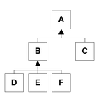

Java Tree Parser
================

I’ve enjoyed building parsers for a long time. There’s something magical about a well-crafted one, especially when the language designer is in collusion with the parser developer.

In 2001, faced with the need to hire a bunch of developers, it occurred to me that a nice little parsing problem could serve as a nice little exercise for screening developers. So I developed a little programming test based on a parsing problem.

Now the test is programming language agnostic. That’s one of the things I like best about it. At the same time, whenever I develop a screening test like this, I find it essential to actually solve the problem at least once myself. This keeps me honest and it’s also serves as a great tool to help other interviewers understand the difference between a working solution, a good solution, and a great solution.

So I developed a solution to the programming problem, in Java, and that’s what you see in this repo.

Run It
------
`gradle run`

Iterators vs. Streams, Then and Now
-----------------------------------
Fast forward to 2014 and I’m sifting through some old code on my laptop and I find this thing. Oh the happy memories! I distinctly remember the joy I felt experimenting with my little [SICP-style](http://mitpress.mit.edu/sicp/) stream implementation in Java. It’s remarkable to me that 13 years later I am still fascinated with infinite sequence and their application to everyday programming problems as evidenced by these recent repos:

* [https://github.com/Bill/enumerator-comparable](https://github.com/Bill/enumerator-comparable)
* [https://github.com/Bill/enumerator-traits](https://github.com/Bill/enumerator-traits)
* [https://github.com/Bill/enumerator-traits-kit](https://github.com/Bill/enumerator-traits-kit)
* [https://github.com/Bill/dbdiff-ruby](https://github.com/Bill/dbdiff-ruby)

The Java code (in this repo) shows how elegant the (functional) streams approach to infinite sequences can be. The IObjectStream interface has three interesting implementations in the Java code:

* `enumerateTree(tree)`: the stream of tree nodes
* `appendStreams(first,second)`: append a possibly infinite stream to the end of a finite one
* `EmptyStream`: the empty stream singleton

At the same time you see the dark side of perhaps mis-applying SICP-style streams to Java. Firstly there is the stack usage. But perhaps worse is the adaptation of those elegant functional streams to the more Java-ish iterators (`java.util.Enumeration`). See how the `EnumerateGraph` class crosses the bridge between the two?

This dichotomy between the functional approach (immutable streams) and the non-functional, approach (mutable iterators) is apparent in the 2001 Java code and it is also apparent in spades in the 2013-2014 Ruby code in the linked repos mentioned above.

Design Decisions
----------------
One of the things I tried to do when I wrote this code was to capture each “design decision” that I made, as I made it. As I made each one, I did my best to leave a comment in the code. There are about 45 design decisions documented in this code.

There are plusses and minuses to this approach from a pedagogic standpoint. To the good, it does present a lot of my thinking. The downside is that big refactors of the code, can cause some early design decisions to be lost since the code they pertain to is gone. Also the bookkeeping is a little hard, so you’ll notice that a couple design decisions have the same numeric id and there might be a couple gaps in ids too. It would be interesting to combine the design decision documentation with Git history, but alas, that didn’t happen with this code.

Funny/Embarrassing Old Objective-C Interface Naming Convention
--------------------------------------------------------------
Oh just look at those interface names e.g. IAssociates, IBinaryPredicate. That’s an echo of the old NeXTSTEP Objective-C interface naming conventions from back in the day (early 90’s) when Objective-C first got interfaces. I did some interesting experiments way back then, with rigorous adherence to interface/implementation separation: using factories everywhere and never mentioning a class in another class (except for factories). Those experiments were interesting and they stuck with me. While a 7-year forray into C++ with its automatic objects mostly cured me of the extreme version of the idea, apparently a “soft” version of it was still with me in 2001.

Abstract Comparison
-------------------
Look at how `GraphComparing.equalGraphs()` leverages (indirectly) the `EqualNodes` node-level comparison, to compare graphs. Composability!

Testing
-------
Believe it or not, testing was important in 2001. This project is not full on TDD, but if you look at `GraphParserTest` you’ll see it tests not only the “unit under test” (the parser), it also tests the test. You can see in the test code that the main purpose of `GraphComparing` in the first place was to test the parser. Isn’t it interesting that so much of the fun of this project arose out of the need to test the project.

And…Oh Yeah, The Parser
-----------------------
Oh yeah, there is a traditional hand-written parser (`GraphParser`) fed by a traditional hand-written lexer (`GraphTokenizer`) in there too. That was kind of the original point. It turns out that this thing is actully more than a tree parser. It’s a full fledged graph parser. Your textual representation can mention nodes twice and the parser will link up the graph for you. Supporting graphs yielded some interesting and elegant code. Have a look at the `AssociatesOnce` implementation of the `IAssociates` (`Enumeration`) interface. It simply uses a `Dictionary` of visited nodes to avoid recursion.

It Still Works! (mostly)
------------------------
The original code was built with, shiver, Microsoft Visual Studio. In resurrecting it I had to find an OS X compatible Java build tool. I’d used Maven of course but I took this opportunity to update my tool chain. I picked [Gradle](http://www.gradle.org/) and boy was that easy and smooth. About 15 minutes of installing and Googling and I had a three-line build.gradle that would run my test app.

There was only a single code incompatibility between the 2001 Java 1.3 code and the 2014 Java 1.8: I had used “enum” as a variable name and that’s now a reserved word. I changed it in three places in GraphParserTest.dumpGraph and all the code compiled and ran without a hitch.

Here’s the actual test:

# Tree Representation and Parsing Test

Introduction
------------
This test provides you the opportunity to demonstrate your knowledge of data structures and algorithms.

## Problem

This is a tree:

Arrows point from sub-trees to their parents.  Boxes represent nodes in the tree.  Each node has a unique, single-character identifier.

**Question 1**: How might you represent this tree as a sequence of characters?

**Question 2**: How much storage (in characters) does your representation take?

**Question 3**: Give a formula for the number of characters your representation would require for complete (full) binary trees (branching factor b = 2)?  Hint: the formula should be a function of N, the number of nodes in the tree.

F2(N) = ?

**Question 4**: Give a formula for the number of characters your representation would require for complete (full) trees an arbitrary branching factor b.  Hint: the formula should be a function of N, the number of nodes in the tree and b, the branching factor.

F(N,b) = ?

**Question 5**: Is your representation “good”?  Are there better representations?

**Question 6**: Construct an algorithm in a language of your choice to parse your tree into an in-memory structure.

`parse( r:Reader):Tree`

**Question 7**: Construct an algorithm that will traverse the in-memory tree and render as a stream of characters.

`enumerate( t:Tree, s:Writer):void`

**Extra Credit**: Starting with the algorithm from question 7 (tree walker), can you alter it so that it lazily enumerates the nodes of the tree.

`lazily_enumerate( t: Tree, w:Writer, e:Enumeration): Node`

**Extra Credit**: Write an algorithm to compare two trees for equality.  Two trees are equal if they have the exact same shape and they have nodes with the exact same names at the same relative positions in the trees.

`compare( lhs:Tree, rhs:Tree):Boolean`
